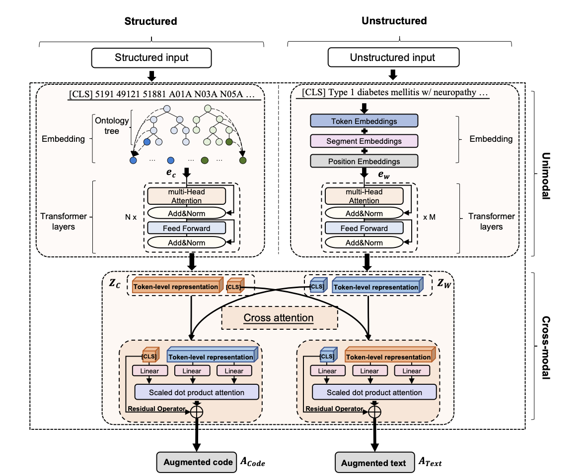

## MedM-PLM

This repository provides the code for [Multimodal data matters: language model pre-training over structured and unstructured electronic health records](https://arxiv.org/abs/2201.10113)

---

## Overview

MedM-PLM handles the inputs from both unstructured and structured EHRs and fuses the information of two modalities in a unified manner. The architecture of MedM-PLM:




---

## Details for Reproducing MedM-PLM

### Pre-training

To reproduce the steps necessary for pre-training MedM-PLM, you can use the script at the `pretrain/run_main.sh`

The clinical notes pre-trained model download from [ClinicalBERT](https://github.com/kexinhuang12345/clinicalBERT)

```
CUDA_VISIBLE_DEVICES=0,1 python main.py \
        --model_name multi_modal_coAtt_residual_pretrain \
	--num_train_epochs 200  \
	--do_train \
	--graph  
```

---

### Fine-tuning

We have conducted three fine-tuning task:

1) **Medication recommendation**
   Mediction recommendation is an important application in healthcare, which aims to build computational models to automatically recommend medications that are suited for a patient's health condition. This task is defined as a multi-label prediction issue. For code-aspect, we concatenated the meam of augmented representations of diagnosis and medications in the historical records(0->t-1th visits) and the augmented representation of diagnoses for the t-th visit, while for the text-aspect, we concatenated the mean of fused Text-to-Code representation of historical records to predic the drug of the t-th visit.

   ```
   CUDA_VISIBLE_DEVICES=0,1 python fusionBert_predict.py \
                   --learning_rate 5e-5 \
                   --seed 2022 \
                   --model_name FusionBert_coAtt_residual_rx_predict \
                   --graph  \
                   --do_train  \
                   --data_name  multilabel  \
                   --predict_task  rx  \
                   --model_choice  fusion_ml \
                   --use_pretrain  \
                   --pretrain_dir $pretrained_model_path
   ```
2) **ICD coding**

   ICD coding fro large-scale clinical notes is labor intensive and error prone. ICD coding usually is treated a multi-label classification problem.

   The ICD coding dataset is based on the [caml-mimic](https://github.com/jamesmullenbach/caml-mimic)
3) **30-day readmission**
   The task considers a patient encounters a "readmission" if the admission date of patient was within 30 days after the discharge date of the previous hospitalization, and was treated as a binary classification task.

   ```
   CUDA_VISIBLE_DEVICES=0,1 python fusionBert_predict.py \
                   --learning_rate 2e-5 \
                   --seed 2022 \
                   --model_name FusionBert_coAtt_residual_rx_predict \
                   --graph  \
                   --do_train  \
                   --data_name  binarylabel  \
                   --predict_task  readm  \
                   --model_choice  fusion_bin \
                   --use_pretrain  \
                   --pretrain_dir $pretrained_model_path
   ```

The details of fine-tuning can find in the folder "*finetuning*".

---

## Result


## Preprocessing

We provide script for preprocessing EHRs on MIMIC-III.

The details can find in the folder [dataset](./dataset).

The pre-training dataset MIMIC-III 1.4 is publicly available at
[https://mimic.physionet.org/](https://mimic.physionet.org/). This is a restricted-accessed resource hosted by PhysioNet, which should be used under the license from the credentialed account of PhysioNet.

* Download [MIMIC-III]([https://mimic.physionet.org/](https://mimic.physionet.org/)) data and put in ./dataset.
  * There are six tables that need to be downloaded.:
    * PRESCRIPTIONS.csv
    * DIAGNOSES_ICD.csv
    * PROCEDURES_ICD.csv
    * LABEVENTS.csv
    * NOTEEVENTS.csv
    * ADMISSIONS.csv
* Download ndc2act, drug-atc,ndc2rxnorm_mapping data from the [GAMENet](https://github.com/sjy1203/GAMENet)

## Requirments

* torch >=1.7.1
* torch-cluster                      1.5.8
* torch-geometric                    1.0.3
* torch-scatter                      2.0.5
* torch-sparse                       0.6.8
* torch-spline-conv                  1.2.1
* torch-tb-profiler                  0.2.1
* torchaudio                         0.7.2
* torchtext                          0.2.1
* pytorch-pretrained-bert            0.4.0
* pytorch-transformers               1.2.0
* python >=3.6.2

## Demo

We provide a simple demo for the medication recommendation  task. Use the fine-tuned model [saved_model](./saved_model). Run the [demo_rec.py](./finetuing/demo_rec.py).

the script is:

```
python demo_rec.py \
		--model_name fusion_ml \
		--output_dir ./debug/ \
		--graph   \
                --do_test  \
                --eval_batch_size 1   \
                --data_name multilabel  \
                --predict_task rx    \
                --model_choice fusion_ml  \
                --saved_model_file $saved_model
```

There are the predicted result:

```
{
    "id_1":{
        "predication":["C01B","C03C","A12A","A12B","M01A","A06A","J01D","B05C","C02D","C01D","A03F","H04A","C01C","A01A","A10A","B01A","N07A","N02A","C07A","A12C","C10A","N01A","A02B","A02A","N02B"],
        "targets":["C01B","C03C","A12A","A12B","M01A","A06A","J01D","B05C","C01D","A03F","H04A","C01C","A01A","A10A","B01A","N07A","C07A","A12C","A04A","C10A","N01A","C09C","A02B","A02A","N02B"
        ]
    },
    "id_2":{
        "predication":["A06A","B05C","V03A","H04A","C08C","A01A","A10A","B01A","C07A","A12C","C10A","A02B","N02B"],
        "targets":["B05C","V03A","H04A","C08C","A01A","A10A","B01A","C07A","A12C","C10A","A02B","A02A","N02B"
        ]
    },
    "id_3":{
        "predication":["C03C","A12A","A12B","A06A","B05C","C01D","A03F","H04A","C01C","A01A","A10A","B01A","N07A","N02A","C07A","A12C","C10A","N01A","A02B","A02A","N02B"],
        "targets":["C03C","A12A","A12B","A06A","J01D","B05C","C01D","A03F","C01C","A01A","A10A","B01A","N07A","N02A","C07A","A12C","C10A","N01A","A02B","N02B"
        ]
    }
}
```
## Quick start
The pre-trained MedM-PLM saved in the [MedM-PLM](./pre-trained%20model/MedM-PLM/), the vocabulary of unstructured data at [Text vocabulary](./pre-trained%20model/MedM-PLM/ClinicalBert/) and the vocabulary of structured data at [Diagnosis code vocabulary](pre-trained%20model/MedM-PLM/dx-vocab.txt) and [Medication code vocabulary](pre-trained%20model/MedM-PLM/rx-vocab.txt).
```
code_tokenizer = EHRTokenizer('structured data dir')
txt_tokenizer = BertTokenizer.from_pretrained('unstructured data dir')
model = MedM_PLM.from_pretrain('MedM-PLM_dir', dx_voc=code_tokenizer.dx_voc,rx_voc=code_tokenizer.rx_voc)
```

## Contact
Please contact [liusicen@stu.hit.edu.cn](liusicen@stu.hit.edu.cn) for help or submit an issue.
## Citation
Please cite [Multimodal data matters: language model pre-training over structured and unstructured electronic health records](https://arxiv.org/abs/2201.10113)
```
@article{liu2022two,
  title={Multimodal data matters: language model pre-training over structured and unstructured electronic health records},
  author={Liu, Sicen and Wang, Xiaolong and Hou, Yongshuai and Li, Ge and Wang, Hui and Xu, Hui and Xiang, Yang and Tang, Buzhou},
  journal={arXiv preprint arXiv:2201.10113},
  year={2022}
}
```
